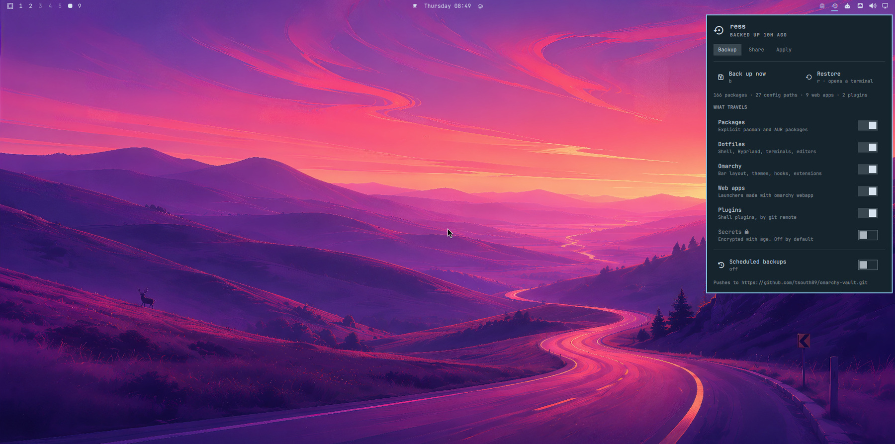
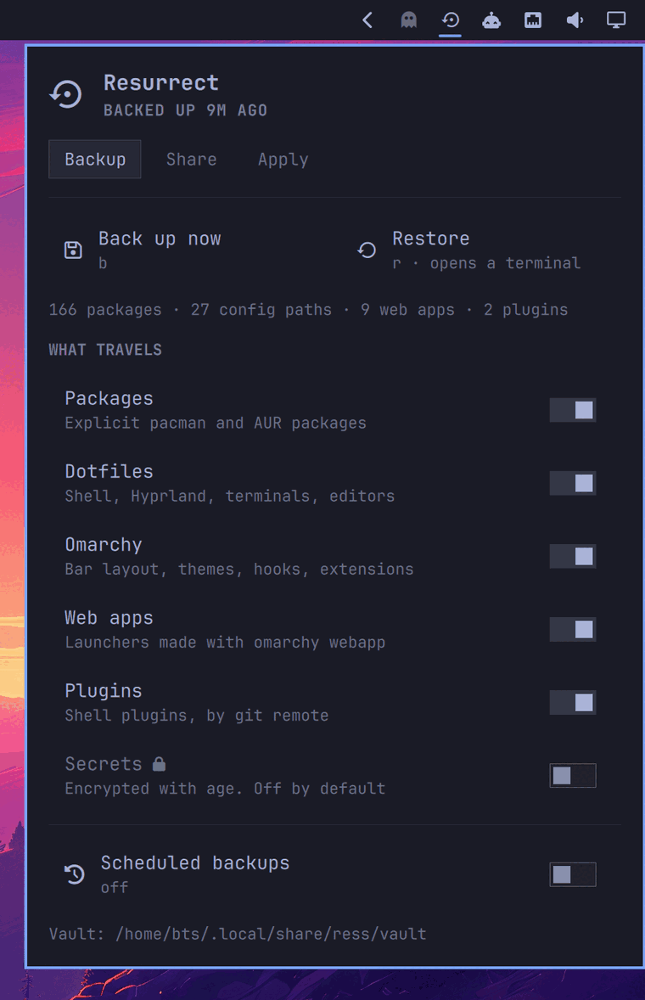
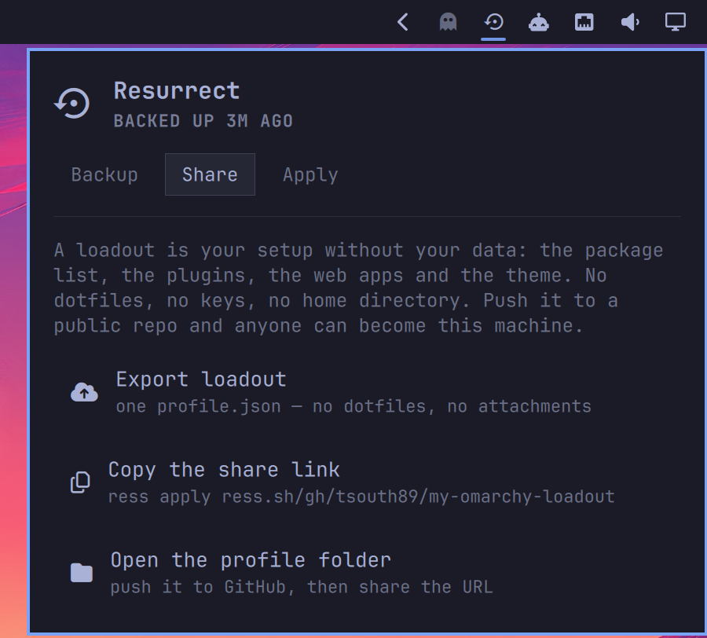
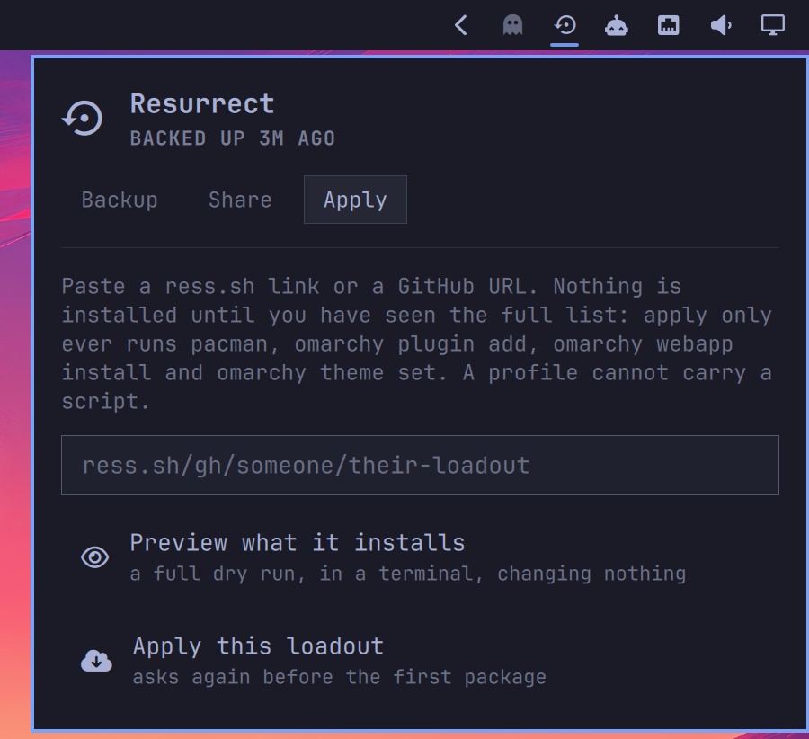
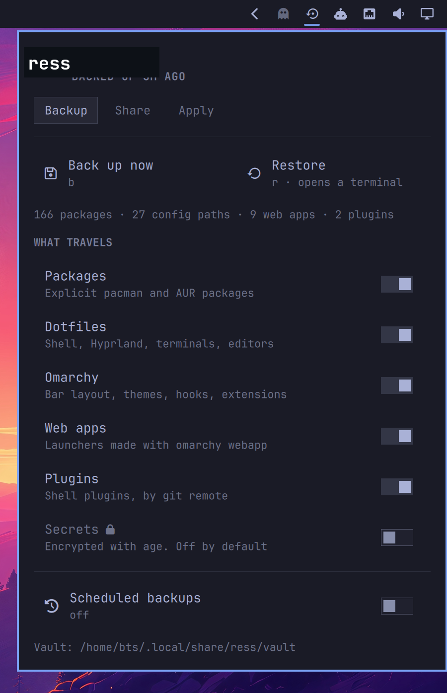

> **This copy.** The code below this note is [btsouth/omarchy-resurrect](https://github.com/btsouth/omarchy-resurrect)
> (MIT-licensed), copied in wholesale rather than tracked as a git fork, to
> build a personal backup/restore/sync layer on top of it — new capabilities
> (starting with an opt-in live-symlink mode) are layered on top of the
> unmodified core described below. See `docs/adr/` in the repo root for the
> decision and current status; everything under this note is upstream's own
> description of `ress` as it works today, kept as-is as documentation of the
> base this builds on.

<h1 align="center">ress</h1>

<p align="center"><strong>Fresh Omarchy to <em>your</em> machine.</strong></p>

<p align="center">
  <a href="docs/preview.jpg"></a>
</p>

<p align="center">
  <a href="docs/demo.gif"></a>
  <br><em>A real backup: 166 packages, 27 config paths, 9 web apps — three seconds.</em>
</p>

Omarchy installs in about a minute. Then you spend the evening putting your
things back: the packages, the dotfiles, the theme, the web apps, the plugins,
the twelve small decisions you have forgotten you ever made.

ress is the other half of that minute.

```bash
ress backup                       # on the machine you like
ress restore --from <your-vault>  # on the machine that has nothing
```

## What it actually costs

Omarchy installs in under a minute because the ISO already carries almost
everything. That works in your favour on the way back: a restore does not
reinstall your machine, it fetches the difference.

Measured on the install in the screenshot — 166 explicit packages, 27 config
paths, 9 web apps:

| | |
|---|---|
| Backup | **3 seconds**, a 1.3 MB vault |
| **Restore onto a fresh Omarchy VM** | **14 seconds** |
| Packages that fresh machine actually needed | **7**, the rest it already had |

The restore is a real one, timed on a clean Omarchy install: it refreshed the
package databases, installed the seven packages the machine was missing, put the
bar layout and theme back, and restored nine web apps and the shell plugins.

ress will tell you that number for your own machine, before you ever
rebuild anything:

```bash
$ ress diff --stock

Distance from a stock Omarchy install

  Omarchy ships                256 packages
  you have explicitly          166 packages
  a fresh Omarchy would fetch  8 packages
  on this machine              all of them are already installed

  cursor-cli fuse2 gtkmm3 hyprpolkitagent mesa-utils opencode
  open-vm-tools stably-orca-bin

  ≈ 145 MB to download.
```

Omarchy installs in under a minute. This puts your machine back in fourteen
seconds. That is the whole idea.

---

## Install

```bash
omarchy plugin add https://github.com/btsouth/omarchy-resurrect --enable
~/.config/omarchy/plugins/tsouth89.resurrect/bin/ress link   # puts `ress` on your PATH
ress init --remote https://github.com/you/my-omarchy-vault.git   # optional
ress backup
```

The vault is an ordinary git repo at `~/.local/share/ress/vault`. Push it
somewhere private if you want it off the machine; keep it local if you don't.
Nothing in ress requires an account, a server, or a service.

### On a machine that has nothing

Two commands, from a TTY, before you have a desktop. No pipe into a shell —
Omarchy's own installer does the fetching, and it validates the manifest and
warns you before it clones anything:

```bash
omarchy plugin add https://github.com/btsouth/omarchy-resurrect --yes
~/.config/omarchy/plugins/tsouth89.resurrect/bin/ress restore --from https://github.com/you/my-omarchy-vault
```

The second command clones your vault and replays it. Afterwards, put `ress` on
your PATH so you can use the short name:

```bash
~/.config/omarchy/plugins/tsouth89.resurrect/bin/ress link
```

The restore is **resumable** — if the AUR times out or the power goes, run it again and it
picks up at the step it stopped on.

---

## What travels

| Category | What it captures | How it comes back |
|---|---|---|
| **Packages** | `pacman -Qqen` and `pacman -Qqem` | only the ones missing here get installed |
| **Dotfiles** | a curated list under `$HOME` — shells, Hyprland, terminals, editors | rsync, with every replaced file kept as `*.ress-bak` |
| **Omarchy** | `shell.json` bar layout, themes, hooks, extensions, branding, active theme | git themes re-cloned at the recorded commit, hand-made themes copied |
| **Web apps** | the `.desktop` launchers made by `omarchy webapp`, plus icons | rebuilt through `omarchy webapp install` from the name, URL and icon — never copied |
| **Plugins** | every shell plugin: git remote, **exact commit**, enabled state | cloned and checked out at that commit, detached |
| **Secrets** | *off by default* — a list you write yourself | `age`-encrypted; see [Secrets](#secrets) |

It also records which **systemd user services** you have enabled, rather than
copying the `.wants/` symlink farms — those are state, and copying them produces
unit files that shadow the real ones. Re-enabling them on the far side is a
separate question that a restore always asks; see
[Two things restore will not do](#two-things-restore-will-not-do-on-its-own).

## What does not travel

Deliberately, and this list is the point:

- **Credentials.** `hosts.yml`, `*.pem`, `*.key`, `.netrc`, `known_hosts` and
  friends are excluded from every capture, in every directory, always. The only
  path a secret can take is the opt-in encrypted one.
- **`~/.config/autostart`**, by default. Every entry in it is a command that runs
  the next time you log in, which is not something a backup should quietly hand
  to another machine. `ress set CAPTURE_AUTOSTART=1` turns it on; the capture
  then says how many entries came with it, and a restore counts them among the
  things the vault will run.
- **Anything over 20 MB** in the dotfile and Omarchy captures, along with
  caches, `node_modules`, `.venv`, `target` and build output. (The encrypted
  secrets bundle has no size cap — it holds exactly what you listed.)
- **Machine identity.** Disk UUIDs, hostname, network state, hardware config.
  A restore should make a machine *yours*, not make it pretend to be another one.
- **Your data.** Documents, photos, repos. ress captures how a machine is
  set up, not what is on it. Use a real backup tool for real backups.

ress tells you what it walked past: anything under `~/.config` that is not
on the list is written to `report/not-captured.txt` in the vault, so "I thought
that was backed up" is a thing you find out on the good machine, not the new one.

---

## Loadouts: your setup as a link

A **loadout** is your machine with your data removed — what is installed, not
what is in your files. It is a single `profile.json`: package names, plugin
repos, web app URLs, a theme name. That is the entire format.

```bash
ress share                                  # writes profile.json, prints your link
ress apply ress.sh/gh/someone/their-loadout # become someone else's setup
```

<p align="center">
  <a href="docs/share.png"></a>
  <a href="docs/apply.png"></a>
</p>

`ress apply` shows you **everything** it would install — every package, every
plugin, every web app — and installs nothing until you say yes:

```
Test Rig — by someone

This will install:

  2 packages from the Arch repos
      cowsay fortune-mod
  1 shell plugin
      acme.widget                      https://github.com/acme/widget
  1 web app
      Fastmail                         https://app.fastmail.com/
  theme tokyo-night (set only; nothing is cloned)

This will not: remove anything, touch your dotfiles, run any script
  from the profile, or read anything outside the four actions above.

Apply this loadout? [y/N]
```

A loadout carries ress itself, so whoever applies yours can immediately
share their own.

`ress.sh/gh/<user>/<repo>` is a redirect to `github.com/<user>/<repo>` and
nothing else — no account, no upload, no copy of your profile. It is expanded
**on your machine, before any request is made**, so `ress apply` never actually
talks to ress.sh and a short link works whether or not the shortener is up.
Plain GitHub URLs work everywhere a short link does.

---

## The panel

<p align="center"><a href="docs/panel.png"></a></p>

A bar icon that dims as your backup gets stale, and a panel that is entirely
keyboard-driveable:

| Key | |
|---|---|
| `b` | back up now |
| `r` | restore (opens a terminal — see below) |
| `s` / `a` | jump to Share / Apply |
| `j` `k` / `↑` `↓` | move |
| `h` `l` / `←` `→` | switch tab |
| `Enter` / `Space` | activate |
| `Esc` | close |

Bind it if you like:

```lua
o.bind("SUPER + SHIFT + B", "ress", hl.dsp.exec("omarchy-shell tsouth89.resurrect toggle"))
```

**Backup runs in the panel. Restore opens a terminal.** That is on purpose: a
restore installs packages and needs `sudo`, and a button that silently acquires
root is a button you should not trust. You watch it and you answer it.

---

## Commands

```
ress backup [-m MSG] [--push] [--secrets]   capture this machine
ress restore [--from URL] [--only LIST]     replay a vault, resumably
              [--skip LIST] [--dry-run] [--restart]
              [--aur|--no-aur|--review-aur]
              [--enable-units|--no-enable-units]
ress share [--name NAME] [--description T]  export a shareable loadout
ress apply <link> [--dry-run]               install someone else's loadout
ress verify [--json]                        check this machine against the vault
ress scan [--json]                          look for credentials in the vault
ress enable-units [--all|--list] [UNIT...]  turn on the services a backup recorded
ress status [--json]                        what is captured, and when
ress diff [--stock]                         what changed since the last backup,
                                            or how far this machine is from stock
ress init [--remote URL]                    create the vault
ress set KEY=VALUE                          change a setting
ress secrets <init|list|add|enable|disable>
ress doctor                                 check this machine is ready
ress link                                   put `ress` on your PATH
```

Every command takes `--yes` for its own confirmations, and speaks a line
protocol with `--porcelain` — which is exactly how the panel drives it. `--yes`
answers ress's questions about overwriting your files; it deliberately does not
answer the two below, which is why an unattended restore takes `--aur
--enable-units` as well.

`--vault DIR` works on any command, to point at a vault other than the
configured one.

`ress verify` exits non-zero when the machine does not match the vault, so it
can be the last line of a provisioning script:

```bash
ress restore --from https://github.com/you/my-vault --yes --aur --enable-units
ress verify || exit 1
```

## Two things restore will not do on its own

Everything a restore does is a write: a file lands somewhere and sits there.
Two steps are different in kind, and both ask first.

**Building an AUR package.** Every other package comes as a signed binary from
the Arch repositories. An AUR package is a PKGBUILD — a shell script fetched
from `aur.archlinux.org` and run on this machine as it builds. That is the one
point where names in a vault become somebody else's code running here.

```
3 packages from the AUR:

    brave-bin
    ttf-fancy
    questionable                     not on aur.archlinux.org

Each one is a PKGBUILD fetched from aur.archlinux.org and run here as it
builds. Nothing signs them and nobody reviews them.

  [y] build them   [r] review each PKGBUILD first   [N] skip
```

`[r]` runs `yay` without `--noconfirm` and without `--answerclean/--answerdiff`,
so yay shows you each PKGBUILD and its diff instead of ress answering those
questions on your behalf. The list is annotated before you answer: names with
nothing behind them upstream, and names the official repositories have since
picked up. `~/.config/ress/aur-deny` drops names before the question is asked.

Declining is neither a failure nor a finish — the category is reported under
"Left for later" and offered again next run, rather than skipped as done.

**Enabling a systemd user service.** This is the only step that arranges for
code to run later without anyone asking again, so the prompt shows what each
unit actually runs:

```
2 user services from this vault, enabled there and not here:

    syncthing.service                  /usr/bin/syncthing serve --no-browser
    phone-home.service                 /home/someone/.local/bin/phone-home --every 60

Enabling them starts them with your session from now on.
Enable 2 user services? [y/N]
```

`ress enable-units` asks the same question later, if you said no or ran without
a terminal. Both settings take `ask` (the default), `yes` or `no`.

## Dependencies

Everything ress needs is already on a stock Omarchy install:

| | |
|---|---|
| Required | `git`, `rsync`, `jq`, `pacman` |
| Optional | `yay` (AUR packages on restore) · `curl` (fetching a loadout by URL; checking AUR names before you are asked about them) · `age` (encrypted secrets) · `expac` (download sizes in `ress diff --stock`) · `wl-clipboard` (copy the share command) |

`ress restore` checks for the required ones before it starts and names the
missing package if any is absent. `ress doctor` reports the whole list.

## Uninstall

```bash
omarchy plugin remove tsouth89.resurrect     # removes the plugin and its bar entry
rm -f ~/.local/bin/ress                      # the PATH symlink, if you made one
```

That is the whole footprint in the shell. Your captured data is yours and is
left alone; delete it explicitly if you want it gone:

```bash
rm -rf ~/.local/share/ress    # the vault and any exported loadout
rm -rf ~/.config/ress         # settings, include/exclude lists
rm -rf ~/.local/state/ress    # the last-backup stamp and restore progress
```

Removing the plugin never touches anything it restored — your dotfiles, packages
and themes stay exactly as they are.

## Configuration

One file, `~/.config/ress/config`, read by both the CLI and the panel. There is
no second source of truth:

```ini
VAULT=/home/you/.local/share/ress/vault
REMOTE=https://github.com/you/my-omarchy-vault.git
# Scheduled backups are off until you turn them on
AUTO_BACKUP=off
AUTO_INTERVAL_HOURS=24
AUTO_PUSH=0

INCLUDE_PACKAGES=1
INCLUDE_CONFIG=1
INCLUDE_OMARCHY=1
INCLUDE_WEBAPPS=1
INCLUDE_PLUGINS=1
INCLUDE_SECRETS=0

# The two things a restore never does on its own: ask | yes | no
AUR=ask
ENABLE_UNITS=ask

# What to do when a capture looks like it picked up a credential: warn | block | off
SECRET_SCAN=warn

# ~/.config/autostart: every entry is a command that runs at your next login
CAPTURE_AUTOSTART=0

# Encrypted secrets: a passphrase, or an age recipient (see below)
SECRETS_MODE=passphrase
SECRETS_RECIPIENT=
PROFILE_URL=
```

`ress set` refuses a value that is not one of a setting's choices, so a
misspelled `AUR=yse` is caught when you type it rather than read as `ask` the
next time a restore runs.

Add paths in `~/.config/ress/include`, exclude patterns in
`~/.config/ress/exclude`, and AUR packages you never want built in
`~/.config/ress/aur-deny`. All three are appended to the lists ress ships in
`defaults/`.

Scheduled backups are event-driven, not polled: the timer is set to the
deadline, so an idle machine wakes it once a day rather than 1,440 times.

## Secrets

Off until you turn it on, and then still explicit:

```bash
sudo pacman -S age
ress secrets init      # writes a list for you to edit — nothing is assumed
ress secrets enable
ress backup            # asks for a passphrase; the vault only ever holds ciphertext
```

The passphrase is never stored, so an unattended scheduled backup skips the
secrets category and says so. Lose the passphrase and the blob is noise —
that is the trade, and it is stated up front rather than in a footnote.

For a backup that runs unattended, use an `age` key instead of a passphrase:

```bash
age-keygen -o ~/.config/ress/secrets.key                       # the private half
age-keygen -y ~/.config/ress/secrets.key > ~/.config/ress/secrets.key.pub
ress set SECRETS_MODE=recipient
ress set SECRETS_RECIPIENT=~/.config/ress/secrets.key.pub      # a path, not an age1… string
```

Backup then encrypts to that key with no prompt. Restore finds the private half
by taking `.pub` off that path, which is why it has to be a path: bring
`secrets.key` to the new machine by hand. It is the one thing a vault
deliberately cannot carry for you.

`ress backup --no-secrets` skips the category for one run; `--secrets` forces it
on for one run.

---

## Security

ress touches your package manager, so here is exactly how and why.

**Nothing happens at install time.** Adding the plugin clones files. There are
no install hooks, no post-install scripts, no `sudo`. The manifest declares
`bar-widget` and `service`; neither runs a package command on its own.

**`pacman` only ever *installs* two ways**, both after you have seen the list
(it is also queried read-only in several places, which changes nothing):

- `ress restore` — replays *your own* vault, and only installs what is missing.
  It prints the packages it will fetch and the plugins it will clone, and what
  in the vault will run on this machine, before it asks.
- `ress apply` — installs from someone else's loadout, after a full preview and
  an explicit confirmation.

Neither ever removes a package, and only one process can touch a vault at a
time. Restore keeps every file it replaces as `*.ress-bak` — including the
bar layout, web app launchers and anything restored from the encrypted secrets
bundle.

**The vault is read back before it is committed.** The capture list is an
allowlist and credentials are not on it — but that is a design, not a guarantee,
and the risk it leaves is a key inside a file that *does* belong in the vault: a
token pasted into a script in `~/.local/bin`, an `Environment=` line in a user
unit. So `ress backup` scans the vault for the shapes credentials have before it
commits, because a commit is the point at which one becomes history, and history
is what gets pushed.

```
$ ress scan
Possible credentials in the vault (1 file):

    home/.local/bin/deploy                               github-token

The match is not shown, and is not written down anywhere.
```

The match is never printed and never saved — the point is to name the file, and
a report that quotes the secret is a second copy of it. The finding list goes to
`~/.local/state/ress`, never into the vault. `SECRET_SCAN=block` refuses the
commit outright. It is a check against known token formats and self-naming
assignments, not a proof: a secret with no shape to it looks like any other
string, and `ress scan` says so.

**A loadout cannot embed a file or a command.** The profile format is one JSON
file whose fields are names and URLs — package names, a theme name, git URLs,
web app URLs. There is no field that holds file contents and no field that holds
a command, so there is nowhere to put one. Web apps are rebuilt from a name, a
URL and an icon through `omarchy webapp install` rather than by copying a
`.desktop` file, because a `.desktop` file *is* an `Exec` line — and a restore
rebuilds the launchers in your own vault the same way, for the same reason.

That is not the same as carrying no code. A loadout names plugin and theme
repositories and `ress apply` clones them, so somebody else's code does end up
running in your shell. What the format buys you is that you see the repo and the
commit before it is fetched, and that the commit cannot move afterwards.

**Nothing is installed from a moving branch.** Backup records the exact commit
each plugin and git theme was on, and restore checks that commit out detached.
A loadout carries the same, so applying someone's setup installs the code they
shared, not whatever they push tomorrow. An entry with no commit — plugin or
theme, on restore and on apply alike — is skipped unless you pass
`--allow-unpinned`.

**The dotfile capture does not follow symlinks out of your home directory.** The
curated `$HOME` list is copied with `--safe-links`, so a link inside a captured
path cannot pull in a file the exclude list was meant to keep out under a
different name, and a restore drops such links on the way back in too. Anything
skipped this way is listed in `report/symlinks-skipped.txt` rather than silently
missing. Omarchy's own directories under `~/.config/omarchy` are captured
separately and copied as they are.

**Restoring a vault runs code, and no amount of validation changes that.**
A machine restore installs the things that machine runs: Omarchy hooks that fire
on update and boot, menu entries whose actions are shell commands, scripts into
`~/.local/bin`, systemd user units, autostart entries if the vault carries any,
and the plugin and git-theme repositories it names — those are real git
checkouts, fetched from upstream at the captured commit, and the shell loads
them. ress validates every *name and path* a vault supplies, and it counts
and lists all of the above before it asks — but it cannot validate file
contents, and it does not pretend to. **Restore a vault only if you trust it as
much as the machine it came from.** Applying a shared *loadout* is the narrower
risk: that format holds no file contents at all, only pinned URLs.

**Names and paths from a vault are still checked.** `restore --from <git-url>` fetches one over the
network, so everything read out of a vault gets the same treatment a shared
loadout gets. Package names, plugin ids, theme names, unit names and labels must
match strict patterns; remotes must be `https` (or an `ssh` git URL when
restoring your own vault). Entries that do not match are refused with a warning,
not quoted and passed along. Every `pacman`, `yay`, `git` and `systemctl` command
built from that data also gets a `--` end-of-options boundary, so a name can
never arrive as an option; the rest are safe on the validator alone.

One field used to escape that rule. A vault's `schemaVersion` was compared with
`(( schema == SCHEMA ))`, and bash arithmetic is not a numeric context — it
evaluates the contents of a bare name and performs command substitution inside
an array subscript, so a vault declaring `CFG[$(…)]` as its schema version ran
that command, before any prompt. Fixed in 1.1.0: a schema version must be a
plain integer before it reaches arithmetic. **If you are on 1.0.0, update.**

Tested against a deliberately hostile vault and a hostile loadout containing
`; rm -rf /`, `$(whoami)`, `-U`, `--overwrite=/etc/passwd`, `../../etc/shadow`,
a plugin id of `../../../../tmp/pwned`, a `file:///etc/passwd` remote, an
`http://` remote, a theme name of `../../../../tmp/evil`, a `.desktop` running
`bash -c "touch /tmp/PWNED"` and a unit name of `evil.service --now`: every
entry refused, `$HOME` unchanged, nothing installed, nothing executed.

**Apply only knows four verbs**: install a package, add a plugin, add a web app,
set a theme. There is no fifth, and no field of a profile is ever run as a
command.

## How this differs from what Omarchy already has

- **`omarchy snapshot`** is snapper on the local disk: excellent for undoing
  this morning, useless when the disk is gone or the machine is new. ress
  is portable and machine-to-machine.
- **The core `omarchy-backup` PR** ([#6965](https://github.com/basecamp/omarchy/pull/6965))
  covers config, packages, themes and web apps from the CLI. ress adds the
  installed **plugin list**, **AUR packages** handled separately, opt-in
  **encrypted secrets**, systemd enable-state, a resumable restore, a native
  Quickshell panel, and shareable loadouts. If that PR lands, use whichever you
  prefer — this one is a plugin, so it costs Omarchy nothing.

## Development

```bash
git clone https://github.com/btsouth/omarchy-resurrect
cd omarchy-resurrect
omarchy plugin validate .
rsync -a --exclude '.git/' ./ ~/.config/omarchy/plugins/tsouth89.resurrect/
omarchy-restart-shell          # QML edits need a restart; hot reload can serve stale code
```

That rsync leaves the installed checkout dirty, and `omarchy plugin update`
refuses to fast-forward over it — in two separate ways. Modified tracked files
block the merge, and so does an *untracked* file that a later commit adds, since
git will not overwrite one. Put the checkout back before updating:

```bash
cd ~/.config/omarchy/plugins/tsouth89.resurrect
git checkout -- .                      # modified tracked files
git clean -nd                          # look at what is untracked first
git clean -fd                          # then remove it (.gitignore'd files are kept)
omarchy plugin update tsouth89.resurrect
```

The CLI (`bin/ress`) is the whole engine and has no QML dependency — it runs
from a TTY on a machine with no desktop. `Panel.qml` and `Service.qml` are a
face on top of it, and every button is one subcommand with `--porcelain`.

```bash
./tests/run.sh              # every case
./tests/run.sh aur          # just the ones whose name matches
./tests/mutate.sh           # break each behaviour, check a test notices
```

[docs/TESTING.md](docs/TESTING.md) covers the whole strategy, including the
real-tools checks worth running before a release and the six things only a
clean VM can tell you.

Each case runs against a throwaway `$HOME` with test doubles on `PATH` for
`pacman`, `yay`, `sudo`, `systemctl`, `curl` and the `omarchy` CLI, so a case
can assert that a restore *did not* call something. Nothing outside the sandbox
is read or written: no package is installed, no unit is enabled, and the fake
`sudo` has no privileges — it records the call and runs the rest of the line as
you.

A passing suite says the tests agree with the code, not that they would notice
if the code were wrong. `tests/mutate.sh` is the check on that: it breaks one
behaviour at a time in a throwaway copy — the AUR gate always builds, the unit
gate always enables, the scanner never finds anything, `verify` always says the
machine matches — and reports any mutation no test caught.

### A note on the plugin id

The plugin id is `tsouth89.resurrect`, from before the project settled on the
name `ress`. It stays: the marketplace keys its registry on it, `shell.json`
records it as the bar entry, and the install directory is named after it, so
changing it would remove the widget from the bar of everyone who has it. Read
it the way you read a bundle identifier — the tool is `ress`.

## License

MIT — see [LICENSE](LICENSE).
